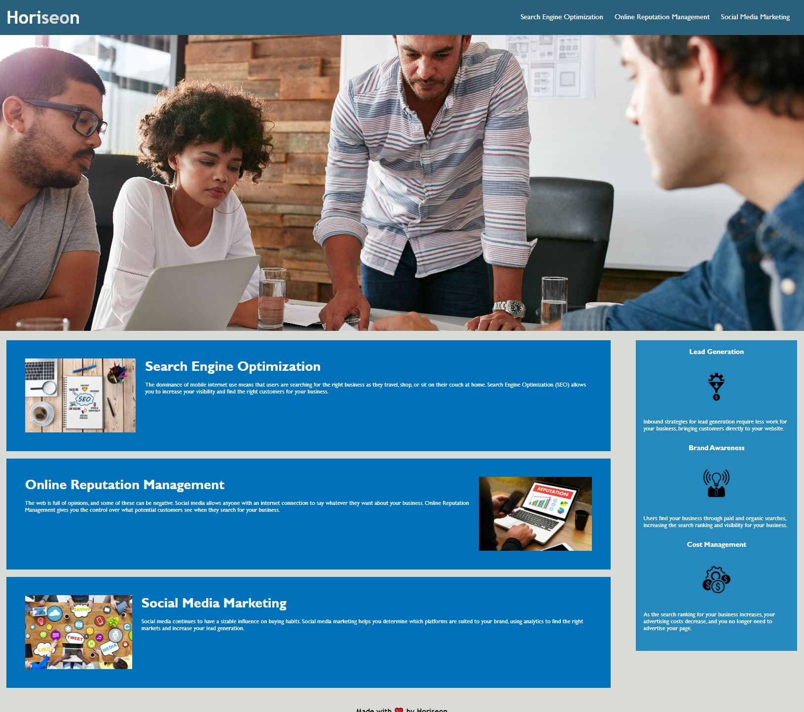

# Module-1-Challange

## Description

This project was so clean up the existing code and make it more presentable and managable. I learned some good practices when writing code and how to compile elements to keep the code simple.

## Usage

[link to landing page](https://raw.githack.com/Akleynhans/Module-1-Challange/main/Develop/index.html)

## Installation

N/A

## Credits

N/A

## License

N/A

